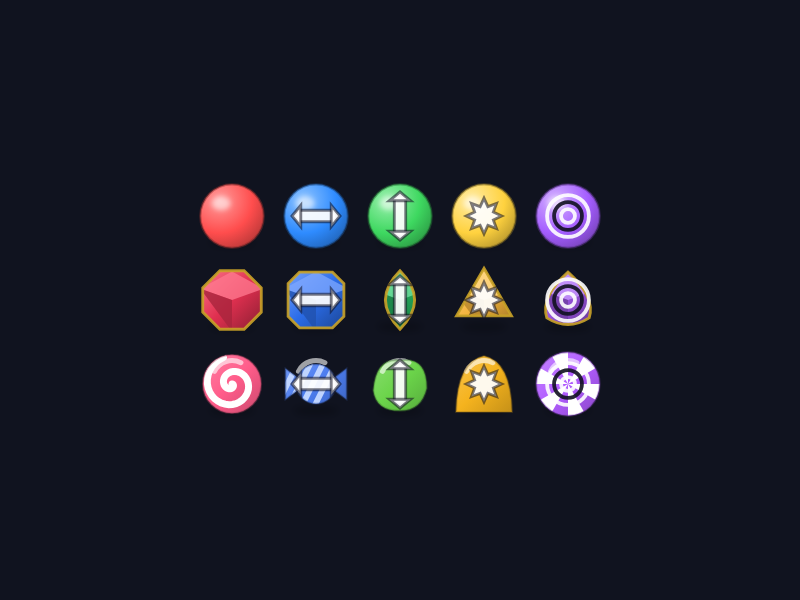

# Skins

A skin is **pure presentation**. It supplies artwork for each tile kind, a background, a board
frame, particle colours and HUD accents. It must never change the number of kinds, the board
size, or any rule. Every skin must look correct for `kindCount` 4 through 7.

All tile art is drawn with `CustomPainter` — no bitmap assets. Reasons: crisp at any DPI, tiny
app size, trivially recolourable, and a new skin is one Dart file instead of an art pipeline.

## Contract

```dart
class Skin {
  final String id;              // stable, used as storage key
  final String name;            // shown in the gallery
  final String tagline;
  final SkinPalette palette;    // background, frame, HUD accents, particles
  final List<TileArt> kinds;    // >= 7 entries; index == tile kind
  Widget buildBackground(BuildContext context);
  CustomPainter painterFor(int kind, TileVisualState state);
}

class TileArt {
  final String name;            // "Ruby", used by semantics / accessibility
  final Color primary;
  final Color secondary;        // highlight / facet / stripe
  final TileSilhouette silhouette;   // circle, rounded square, gem cut, ...
  final IconGlyph? symbol;      // optional accessibility stamp
}
```

`TileVisualState` carries `selected`, `hinted`, `clearing`, and an animation `t` in `0..1` so
one painter covers idle, selection glow and the collect pop.

## Shipped skins (v1)

### 1. Classic Arcade — `classic_arcade`

Glossy spheres in an arcade cabinet. Nostalgic, high contrast, reads instantly.

- Silhouette: sphere for all kinds — radial gradient from a top-left specular highlight to a
  darkened rim, plus a soft contact shadow.
- Background: near-black `#0B0E1A` with a faint scanline vignette; board frame is brushed
  metal with a neon inner edge that pulses on cascades.
- HUD accent `#21E6C1`, particles inherit the cleared tile's colour.

| Kind | Name | Primary | Highlight | Symbol (accessibility) |
| --- | --- | --- | --- | --- |
| 0 | Red | `#FF4D4D` | `#FF9B9B` | filled circle |
| 1 | Blue | `#2E8BFF` | `#8FC4FF` | cross |
| 2 | Green | `#3ED860` | `#9BF0AE` | triangle |
| 3 | Yellow | `#FFD23F` | `#FFEBA3` | star |
| 4 | Purple | `#A45DFF` | `#D3B0FF` | square |
| 5 | Teal | `#21E6C1` | `#9BF5E5` | ring |
| 6 | Orange | `#FF8A3D` | `#FFC49B` | diamond |

Because every tile is a sphere, this skin depends on the **symbols** setting for colour-blind
players. The setting is off by default and lives in Settings; when on, the glyph is stamped in
a 55 %-opacity dark tint at 40 % of tile size.

### 2. Treasure Hunt — `treasure_hunt`

Cut gemstones on carved stone, lit by torchlight. Each kind has its own **cut**, so it is
readable without colour at all.

- Silhouettes: round brilliant, emerald (step-cut rectangle), marquise (pointed oval),
  trillion (rounded triangle), pear, heart, kite.
- Each gem is drawn as a polygon with 3–5 facet paths, a bright crown facet, a darker pavilion
  and a thin gold rim (`#C9A227`).
- Background: dark stone `#221A14` with a warm radial torch glow; frame is chiselled rock with
  gold corner studs. Cleared gems burst into gold sparkles.
- HUD accent `#E8C36B`.

| Kind | Name | Primary | Facet | Cut |
| --- | --- | --- | --- | --- |
| 0 | Ruby | `#E03050` | `#FF7A90` | round brilliant |
| 1 | Sapphire | `#2B6CE8` | `#7FA8FF` | emerald |
| 2 | Emerald | `#22A85A` | `#74E3A2` | marquise |
| 3 | Topaz | `#F2B23A` | `#FFD98A` | trillion |
| 4 | Amethyst | `#9450D8` | `#C99BFF` | pear |
| 5 | Diamond | `#A8E6F0` | `#EAFBFF` | heart |
| 6 | Onyx | `#4A4458` | `#8A80A0` | kite |

### 3. Candy Shop — `candy_shop`

Bright, soft, friendly. Distinct silhouettes again; the most "casual" of the three.

- Silhouettes: lollipop swirl, wrapped hard candy (twisted ends), jelly bean, gumdrop,
  chocolate square, peppermint disc, liquorice wheel.
- Soft outer glow, thick white specular arc, subtle squash on landing.
- Background: pastel diagonal stripes `#FFF3F8` / `#FFE9F2` with floating bokeh dots; frame is
  a mint-green rounded bar. Clearing sprays sugar-crystal particles.
- HUD accent `#FF5C8A`.

| Kind | Name | Primary | Accent | Shape |
| --- | --- | --- | --- | --- |
| 0 | Strawberry | `#FF5C8A` | `#FFFFFF` | lollipop swirl |
| 1 | Blueberry | `#4C7DF0` | `#BFD4FF` | wrapped candy |
| 2 | Lime | `#6BD44A` | `#D2F5C4` | jelly bean |
| 3 | Lemon | `#F5B31E` | `#FFF0BF` | gumdrop |
| 4 | Grape | `#B15CFF` | `#FFFFFF` | peppermint disc |
| 5 | Chocolate | `#8A5A3C` | `#C08A63` | chocolate square |
| 6 | Liquorice | `#3D3A46` | `#F0EDF5` | liquorice wheel |

## Power markers

Tiles that earn a power (docs/CONCEPT.md §2) keep their skin artwork and gain a marker drawn
on top: a double arrow for a row or column clear, a starburst for a bomb, concentric rings for
a colour bomb. The markers are white with a dark rim rather than per-skin art, so one set reads
on gemstones, candy and glossy balls alike, and a new skin inherits them for free.

They are kept deliberately small — a full-width marker spills outside narrow silhouettes like
the marquise gem and the trillion cut.



Regenerate that picture with:

```bash
flutter test --update-goldens --dart-define=preview_art=true   test/skins/power_preview_test.dart
```

## Accessibility requirements

Every skin must pass these before it ships:

1. **Shape or symbol redundancy** — no two kinds distinguishable by hue alone (either distinct
   silhouettes, or symbol support like Classic Arcade).
2. **Luminance spread** — the lightest and darkest kinds differ by at least 12 % relative
   luminance, so a greyscale screenshot is still playable.
3. **A visible hint ring** — `palette.hint` must reach 2:1 against the composited board cell.
   Candy Shop originally inherited a white ring and it vanished into the pale counter; the
   ring is now dark plum there, cyan on Classic Arcade, pale gold on Treasure Hunt.
4. **Contrast against the cell** — tile primary vs the board cell colour composited over the
   background >= 1.5:1. Measuring against the *cell* rather than the raw background is what
   the player actually sees; the Candy Shop palette was retuned after this rule caught its
   lemon washing out on the pale counter.
5. **Pairwise distinctness** — every pair of kinds is at least 60 apart in RGB distance.
6. **Reduced motion** — backgrounds are static by construction (painted once, never animated),
   so the setting only has to shorten board animations.

`test/skins/skin_contract_test.dart` asserts 1–5 mechanically for every registered skin, and
paints each kind in every visual state at two sizes to catch painter crashes.

## Adding a new skin

1. Add a `Skin` constant to `lib/skins/skin_registry.dart` with seven `TileArt` entries.
2. If it needs a silhouette that does not exist yet, add the `TileShape` value and its path to
   `lib/skins/tile_shapes.dart`, and a decoration branch in `TilePainter` if the family needs
   one. A new skin should not need a new painter class.
3. Add a backdrop branch in `skin_background.dart` (or reuse a plain gradient).
4. Add its palette table to this document.
5. Run `flutter test test/skins/` — the contract test picks it up from the registry
   automatically; no test file edits needed.

Backlog skin: **Neon Lab** — glowing glyphs in test tubes on a dark grid, with chromatic
aberration on cascades.
